# Introduction

This lab is dedicated to demonstrating the basic concepts of encryption. To be specific, the lab will explain hashing messages for authentication and information validation in addition to symmetric and asymmetric encryption. This lab will also apply those concepts in order to ensure confidentiality, integrity, and authentication of information shared across the Internet.

# Hands-On Demonstration

## Creating a MD5sum and SHA1sum Hash String

### Applying MD5sum to an example document

In this step, I created an example text document that is to be used for MD5sum hashing. From the terminal, the message is loaded in its entirety and then has the hashing algorithm applied to it. The screenshot below shows both the text document’s original message and the resulting hexadecimal string.

  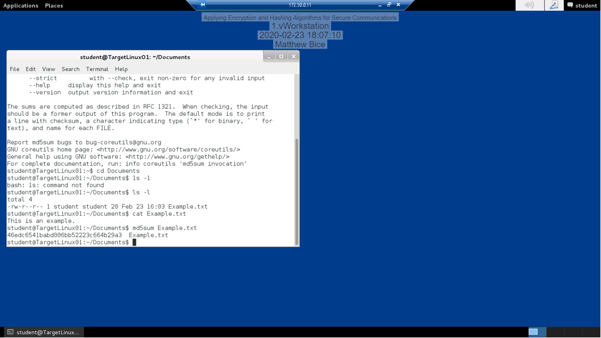

### Store the text file as a string and compare hexadecimal sums

In the previous step, the example text file had MD5sum hashing applied to it. This step, then, takes this resulting hash and stores it as its own file. This file is then open and read in order to demonstrate that the hexadecimal sums of the original hashed .txt file and the newly created .txt.md5 are equivalent. This equivalency proves that the file’s contents were not altered due to the hashing.

  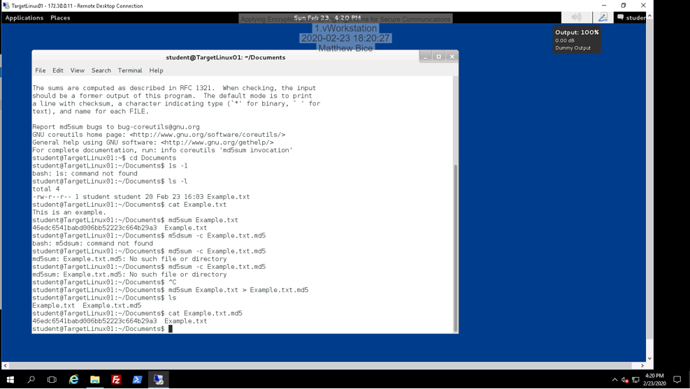

### Apply SHA1 hashing to the text file

In this step, the same text document is used but rather than apply MD5sum hashing, SHA1sum hashing is used instead. The screenshot below shows the hexadecimal string resulting from the SHA1sum hashing.

  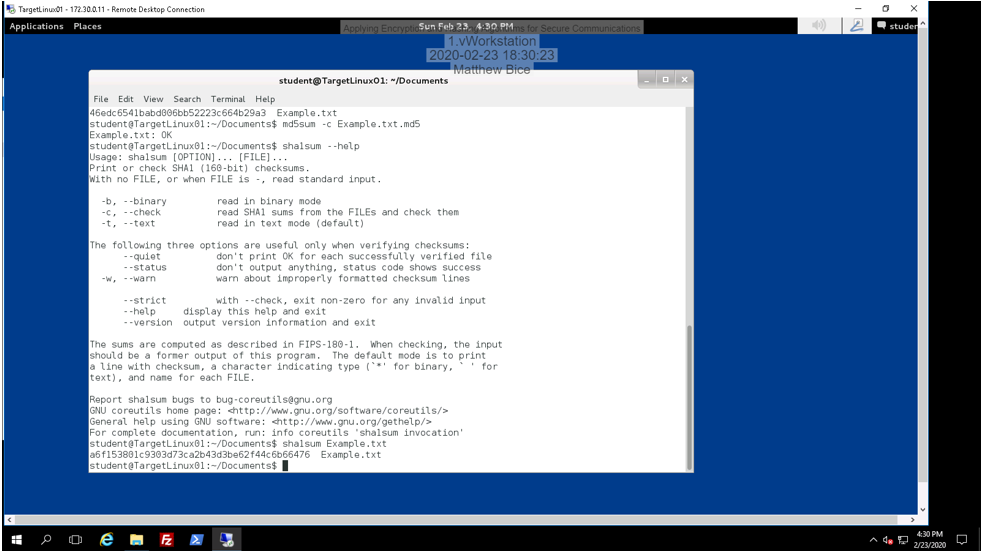

### Store the hexadecimal text file in a new file and compare hexadecimal values

Once again, the resulting hexadecimal string from the SHA1sum hashing is stored in its own .txt.sha1 file. The contents of this file are then read and the screenshot below proves that the hexadecimal values from the .txt and .txt.sha1 files are equal. This means that the file’s contents were unaltered during the hashing.

  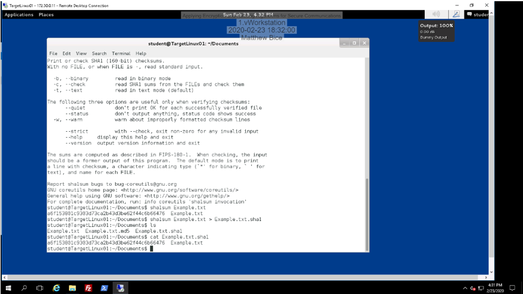

## Modifying a File and Verifying Hash Values

### Add new text to the example text and display the different hexadecimal value (MDS5sum)

In this step, the terminal is used to append my name to the example text file. This new text is then hashed with the MD5sum algorithm and the resulting hexadecimal string is displayed. Notice that this hexadecimal value is not equivalent to that of the original message.

  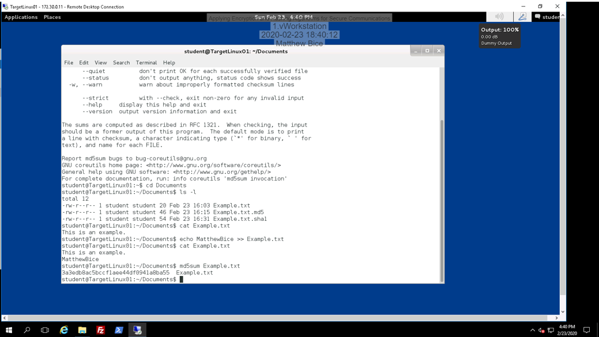

### Add new text to the example text file and display the different hexadecimal value (SHA1sum)

Like the previous step, the new text file is hashed with the SHA1sum algorithm and the resulting hexadecimal string is displayed. Again, this hexadecimal value is not equivalent to that of the original message.

  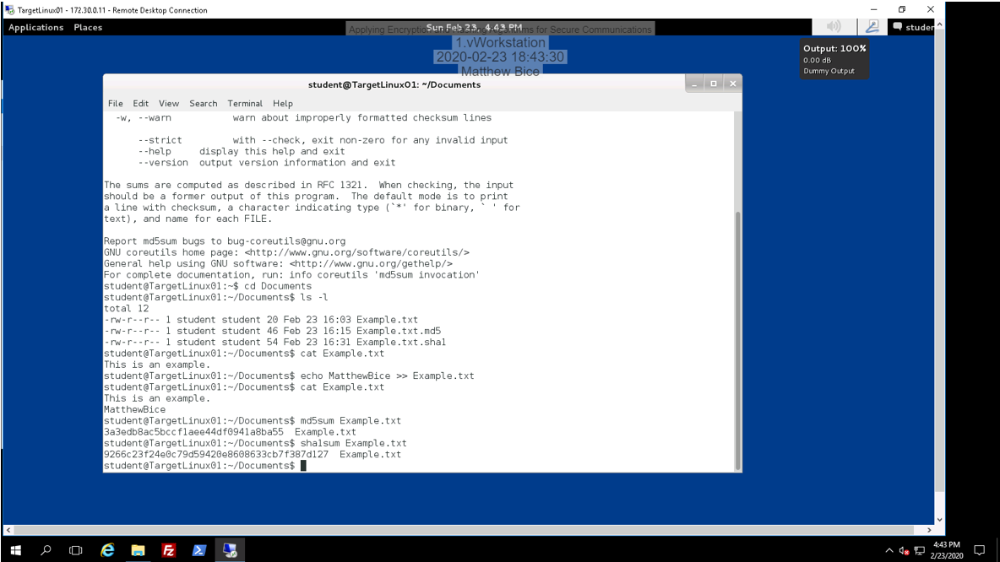

## Generating GnuPG Keys

### Create a GPG key for a student user

This step describes the process of creating a GPG key. To begin, a key generator is used in the terminal. The key is configured to be of type RSA and RSA (default), have a size of 1024 bits, and have no expiration date. A template student name and student email address are used with a passphrase in order to help identify the key. From there, a series of tasks are done on the computer for some time to generate entropy (or random bytes) that are used to generate the key. Once this is all complete, the key is saved and shows in the Documents directory. (Note: The screenshot contains some failed attempts because I attempted to continue while the generator was still generating random bytes).

  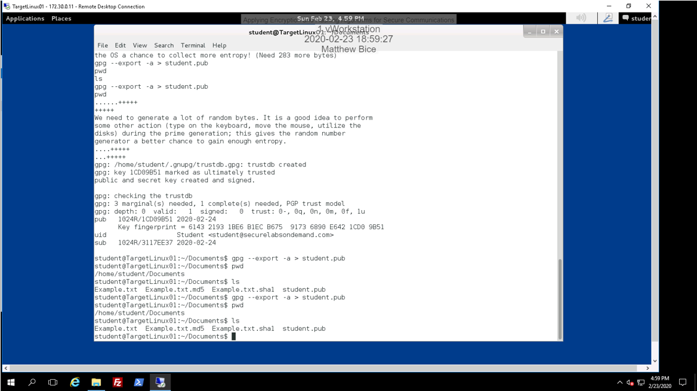

### Create a GPG key for an instructor user

Now that there is a key for the student, one must also be made for the instructor. The same steps from earlier are repeated (the name and email address are changed) and a GPG key is made for the instructor. This key is then saved as instructor.pub in the home/Instructor directory.

  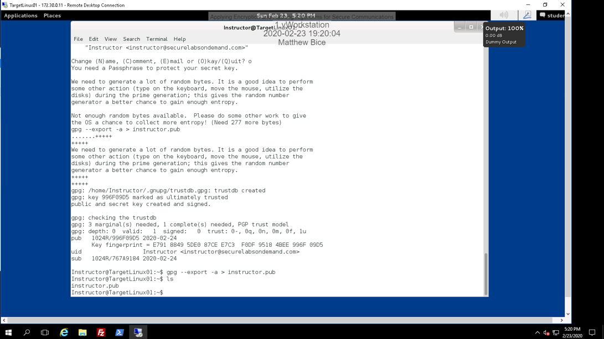

## Share a GnuPG Key

### Share the GPG key between the student instructor

After returning to the student’s directory, the instructor.pub key is copied and pasted. From there, the instructor’s key is imported into the student account’s key ring. The screenshot below shows this.

  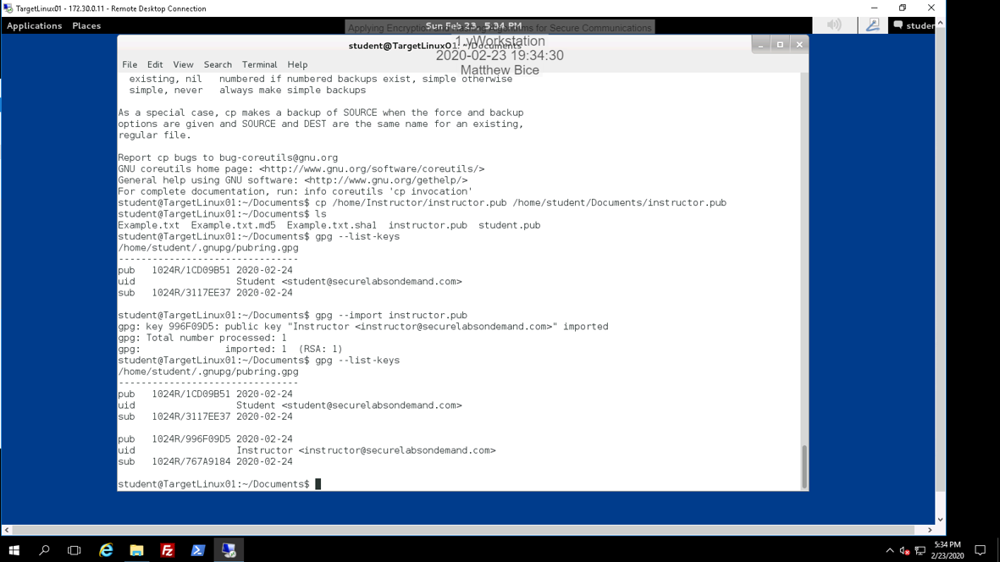

## Encrypt and Decrypt ClearText Message

### Create and encrypt a ClearText message

In this step, the “echo” command is used in the terminal to create a clear-text file that is to be used for encryption/decryption. Once the file is created, it is then encrypted and the recipient (the instructor) is specified. From there, the cleartext.txt.gpg is opened to reveal the encrypted message. The screenshot below shows this encryption.

  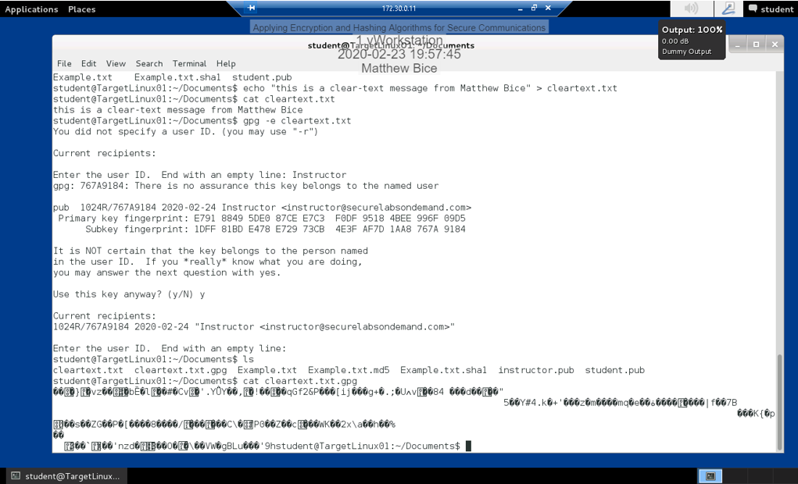

### Decrypt the ClearText message

Now that the message is encrypted, it is then copied and pasted over to the Instructor’s account. From there, the instructor’s permissions are changed so that the file can now be viewed. By providing the GnuPG key, the instructor can now decrypt the cleartext.txt.gpg file. After the passphrase is entered, the decrypted message is shown. The screenshot below shows the decrypted message.

  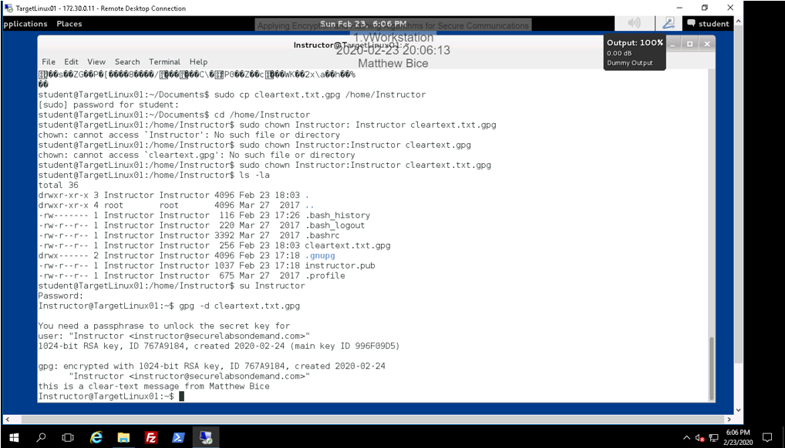

# Applied Learning

## Create a MD5sum and SHA256sum Hash String

### Create a new example text file and hash it with MD5sum

This step is like the process earlier in the lab. Using the command prompt and the vi editor, a new text file is created. Then, using MD5sum, the message is hashed. The screenshot shows both the original and hashed file’s hexadecimal values. Once again, they are identical.

  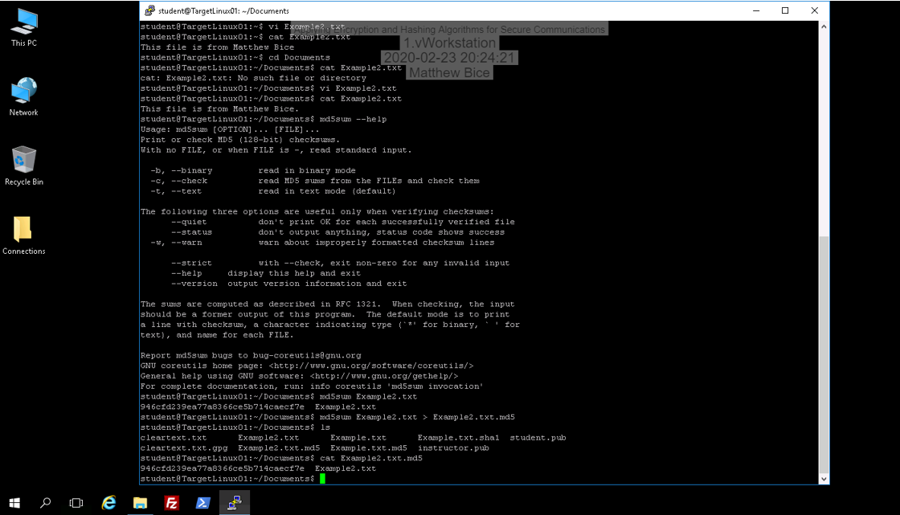

### Hash the example text file with SHA256sum

Similarly, the same steps as the previous step is taken, except now the hashing algorithm is SHA256sum. The screenshot shows the identical original and hashed hexadecimal values (note: There is a failed attempt in between. The bottom string and the string after the one above it are the values).

  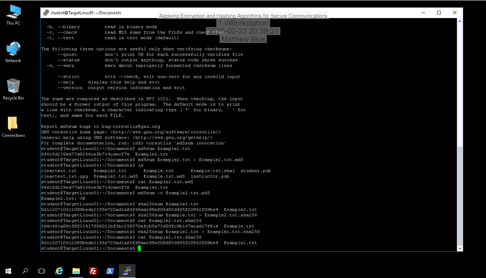

## Modify a File and Verify Hash Values

### Modify the example text file and hash it again with MD5sum and SHA256sum

This step takes the example text file and adds additional text. From there, thee same steps as earlier are taken to convert the file to either .txt.md5 or .txt.sha256. The hexadecimal values for these messages are then displayed. Notice that they are not as same as their predecessors.

  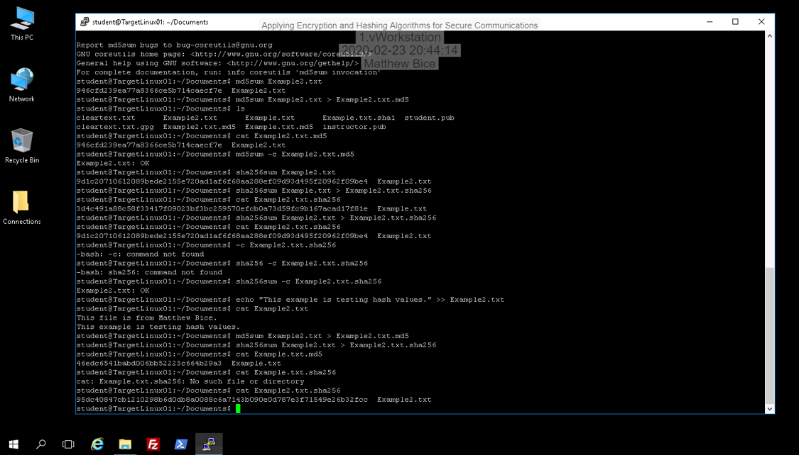

## Generate GnuPG Keys

### Create the GnuPG keys for student2 and instructor2

In this step, a GnuPG key is created for a student2 user and an instructor2 user with the GPG key generator. A difference to note is the length has been changed to 2048 bits. Entropy is then created so a key can be generated. The screenshot below shows the second instructor’s public key ring.

  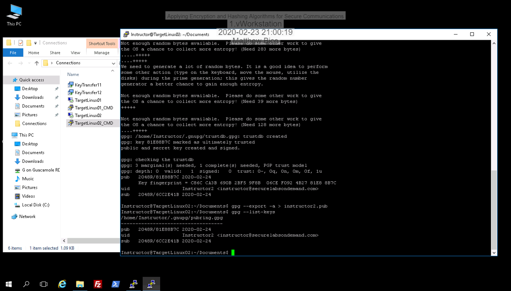

## Share a GnuPG Key

### Apply instructor's key to student's key ring

This step consisted of the transfer of keys, but in a slightly different way. Rather than going through a terminal, a shortcut was used to connect the two accounts and copy over the keys. The properties of the instructor2.pub file is then modified so that the student will appear as the owner. The screenshot shows the student account’s appended key ring.

  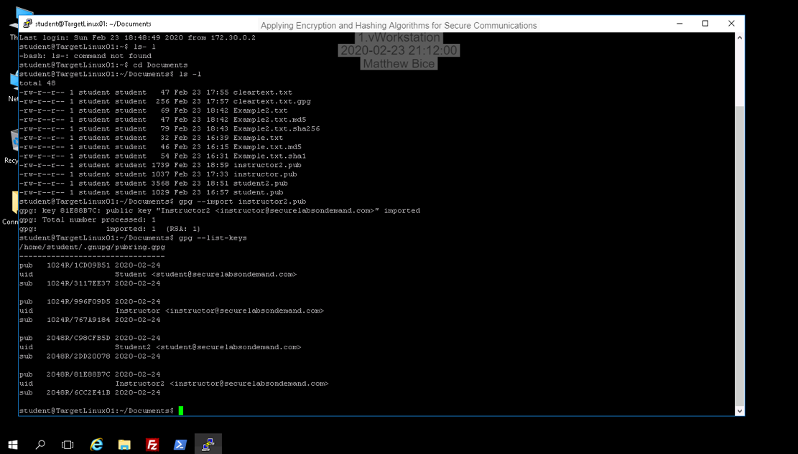

## Encrypt and Decrypt a ClearText Message

### Decrypt sent ClearText message

This step begins by creating a ClearText message that is then encrypted with GPG. Then, using the shortcuts from earlier, the encrypted file is transferred over to the student and instructor accounts and the properties are modified to make the instructor the file’s owner. Then, using the instructor’s key ring, the instructor can decrypt the encrypted ClearText message after providing the passphrase. The screenshot shows the completed decryption.

  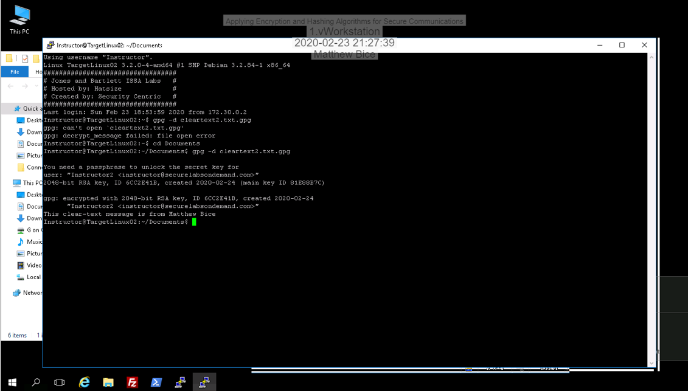

# Lab Challenge and Analysis

One of the major differences between RSA and ECDSA encryption is key size. As <a href="https://www.ssl.com/article/comparing-ecdsa-vs-rsa/" target="_blank">SSL.com</a> states, “a common 2048-bit public key provides a security level of 112 bits. However, ECDSA requires only 224-bit sized public keys to provide the same 112-bit security level.” Additionally, the article goes on to explain that “RSA seems to be significantly faster than ECDSA in verifying signatures, though it is slower in signing.” Though not specific, Comparitech.com (https://www.comparitech.com/blog/information-security/rsa-encryption/) states that RSA is used by a variety of email, VPN, chat, and communication channels. On the other hand, an SSL report taken from (https://security.stackexchange.com/questions/58603/are-any-major-websites-offering-ecdsa-authentication) reveals that services such as Facebook use ECDSA encryption.

## Tools and Commands

The following is a hexadecimal string taken from Send.txt:

  

In the screenshot below, the left panel is the student’s command prompt, and the instructor’s is the right.

  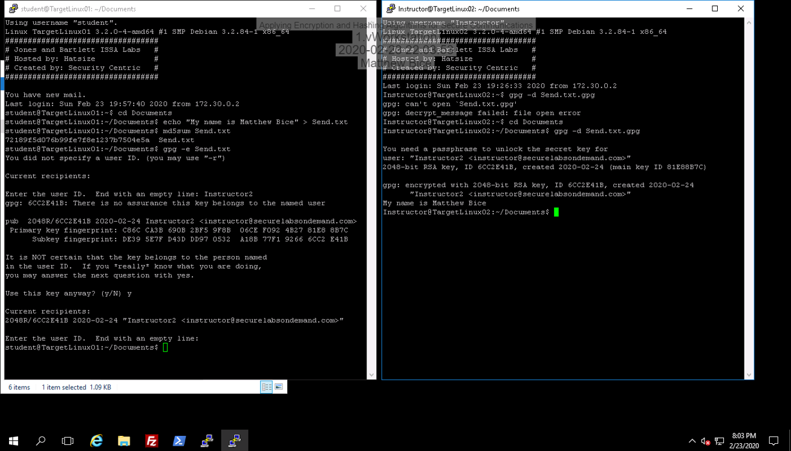

## Challenge and Exercise

The following screenshot shows the encryption and decryption processes through the command terminal between me and an instructor.

  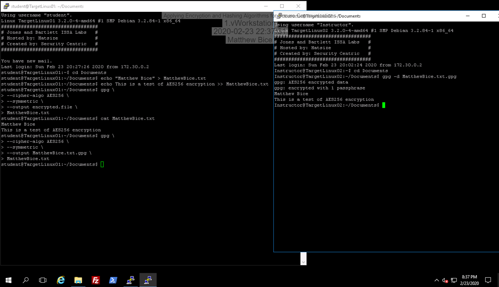

